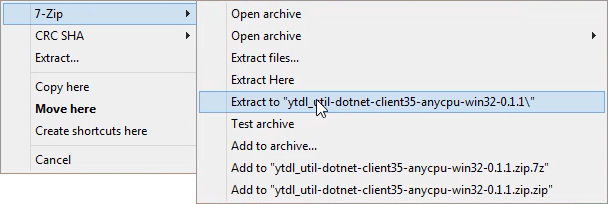
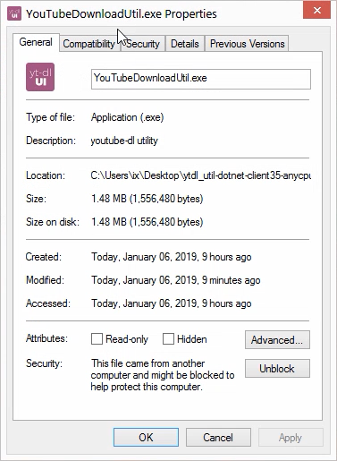

[paket]:            https://fsprojects.github.io/Paket/getting-started.html
[patch]:            .patch/20180904-e0a2d1702aae5a4f267cc60d847c2c64c1a5b0bc-html-renderer-changes-used.diff
[AtomicParsley]:    http://atomicparsley.sourceforge.net/
[youtube-dl]:       https://rg3.github.io/youtube-dl/
[FFmpeg]:           https://ffmpeg.org/
[PhantomJS]:        http://phantomjs.org

A simple (prototypical) youtube-dl wrapper in winforms.

Setting Up
=======================

Download and Extract the Bundle
-----------------------

Just visit the releases page and you'll encounter too many words but at least you can download a bundle with either Win64 or Win32 versions of FFmpeg and other (necessary) tools.  
https://github.com/tfwio/youtube-dl-winforms/releases

The reason its so big is due to the bundled binaries (in the ./tools directory) aside from my little utility (UI) app.  
Its configured to-go and will download to the example downloads directory.

When extracting, I suggest using 7-zip.  Use the Right-Mouse button and use the z-zip submenu: “Extract to "./ytdl_util-dotnet-client35-anycpu-win32-0.1.1"” (since the archive's contents are as shown in the image below)

If you use windows shell "Extract..." method (via right-clicking the bundle.zip's context-menu), windows will likely "Block" every executable extracted like it does every binary you downloaded (which probably just amounts to some annoying popup dialog confirmations) as illustrated when you right-click `YouTubeDownloadUtil.exe` and select "Properties".
You can see what I mean in the below snap-shot of the Property Page for the binary...
Hence, why I prefer to use 7-zip (https://www.7-zip.org/) to extract.

Adding a 'Download Target'
------------------------

[old] Setup instructions
=======================

I hadn't provided binaries yet.  
Few more little perks to be added.

doesn't mean that it doesn't take the sting out of using youtube-dl.

get your binaries
-----------------

Once you build or have a binary (as in this app), you'll need pretty much all of the following three apps.

Put (Extract) them all generally into some safe place where they wont get deleted or moved.

Launch YouTubeDownloadUtil.exe  
and perhaps click the drop-down arrow next to the text box to set the window on top for a moment?  
Finally, Drag-Drop each of the (target) executables: youtube-dl.exe, FFmpeg.exe and AtomicParsley.exe
directly into the YouTubeDownloadUtil.exe window.

[youtube-dl]

- DDL: `https://yt-dl.org/latest/youtube-dl.exe`

[AtomicParsley]

- DDL: `https://sourceforge.net/projects/atomicparsley/files/atomicparsley/AtomicParsley%20v0.9.0/AtomicParsley-win32-0.9.0.zip/download`

[FFmpeg] --- but of course

- DDL Win32: `https://ffmpeg.zeranoe.com/builds/win32/static/ffmpeg-latest-win32-static.zip`
- DDL Win64: `https://ffmpeg.zeranoe.com/builds/win64/static/ffmpeg-latest-win64-static.zip`

[PhantomJS] --- optional (for the wanton)

- http://phantomjs.org/download.html

Add Directory Targets
----------------------

Just drag a folder into the app and it will then show in your
download targets (BIG dropdown arrow in the upper right shows this).

Once you've dragged a folder in to the app, you have to select
the target in the menu.

Otherwise, you can just select one of the system directories
in the "Target: Shell Folder" menu-item.

Downloading Stuff
----------------------

The idea is to drag-drop from your browser's address-bar
into the youtube-dl-ui window, then select a download format.

If there's an error, you'll know why if you read the output.

Click the tiny drop-down arrow to select (AND IMMEDIATELY
START DOWNLOADING) — or just click the button.

**PLAY AROUND WITH THE OPTIONS** via the main menu to see
what they do or go to youtube-dl's website for more info.

